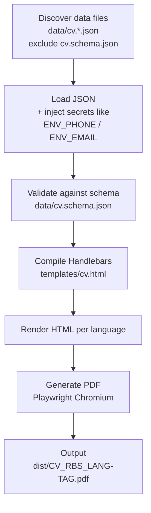

# RBS — Curriculum Vitae Generator

Generate versioned, single-page A4 PDFs of Roberto Stanziale's CV from typed JSON + Handlebars, via Playwright.

> Sanitized CVs without personal information are available on the [Releases](https://github.com/rstanziale/curriculum-vitae/releases) page.

## How it works



Each language file loops through `load → validate → render → print` — adding `data/cv.fra.json` is enough to produce `CV_RBS_FRA-{tag}.pdf` with no code change.

## Project Structure

```
curriculum-vitae/
├── data/            # CV content — one JSON per language + JSON Schema for validation
├── templates/       # Handlebars layout — A4 grid, BEM CSS, @page/@font-face
├── assets/fonts/    # Montserrat TTF — embedded at build time so PDFs are self-contained
├── src/
│   ├── config/      # Centralized paths and version tag
│   ├── data/        # Loading, secret injection, and Ajv validation
│   ├── template/    # Handlebars registry and compiler
│   ├── pdf/         # Playwright pipeline — options, viewport, font embedding
│   ├── utils/       # FS helpers and timing
│   └── errors/      # Domain errors
├── test/            # Mirrors src/ + integration test that parses real PDFs
└── dist/            # Generated PDFs (gitignored)
```

## Stack

TypeScript (ESM) · Handlebars · Playwright · Ajv

## Prerequisites

- Node >= 20, pnpm
- `npx playwright install chromium` (once)

## Quick Start

```bash
pnpm install
npx playwright install chromium

# .env — see below
pnpm run build:dev   # node --env-file=.env src/index.ts
# or
pnpm run build:prod  # node src/index.ts (uses process.env)

pnpm test            # node --test
```

## Configuration

### Environment Variables

Create `.env` at project root:

```env
CV_TAG="v1.0.0"
PERSONAL_PHONE="+39 320 000 0000"
PERSONAL_EMAIL="name@example.com"
```

| Var | Purpose | Default |
|---|---|---|
| `CV_TAG` | Version suffix in `CV_RBS_{LANG}-{tag}.pdf` | `test` |
| `PERSONAL_PHONE` | Replaces `ENV_PHONE` placeholder | `+39 000 000 0000` |
| `PERSONAL_EMAIL` | Replaces `ENV_EMAIL` placeholder | `email@example.com` |

`build:dev` loads `.env` via `--env-file`; `build:prod` expects vars in the shell (CI).

## Data & Template

Minimal `data/cv.*.json` shape (full schema in `data/cv.schema.json`):

```json
{
  "personalInfo": {
    "firstName": "Roberto",
    "surname": "Stanziale",
    "phone": "ENV_PHONE",
    "email": "ENV_EMAIL"
  },
  "labels": {
    "aboutMe": "About Me",
    "skills": "Skills"
  },
  "aboutMe": "Short bio...",
  "languages": [{ "name": "Italian", "level": "Native" }],
  "hardSkills": ["TypeScript", "Angular"],
  "workExperience": [
    { "company": "Acme", "role": "Developer", "period": "2020 / now" }
  ]
}
```

`templates/cv.html` binds data with `{{personalInfo.firstName}}`, `{{#each languages}}`, etc. by following Hendlebars syntax. CSS is scoped to the `cv` class and uses BEM naming.

## PDF Requirements

Product constraints the pipeline enforces:

- **One page, A4** — `@page { size: A4; margin: 0 }`, viewport `794×1123`. The build warns if content overflows the single page.
- **Zero margins, background preserved** — colors and Montserrat render exactly as in the template.
- **Fonts embedded** — `assets/fonts/Montserrat-*.ttf` are inlined as `data:` URIs so the PDF renders offline and is identical on any machine.
- **Self-contained HTML** — a `<base>` tag is injected so relative asset paths resolve without a server.
- **Versioned output** — each PDF is named `CV_RBS_{LANG}-{tag}.pdf` from `CV_TAG` (defaults to `test`).

## Output

The following PDFs are generated in `dist/` when the build succeeds:

```
dist/CV_RBS_ITA-v1.0.0.pdf
dist/CV_RBS_ENG-v1.0.0.pdf
```
