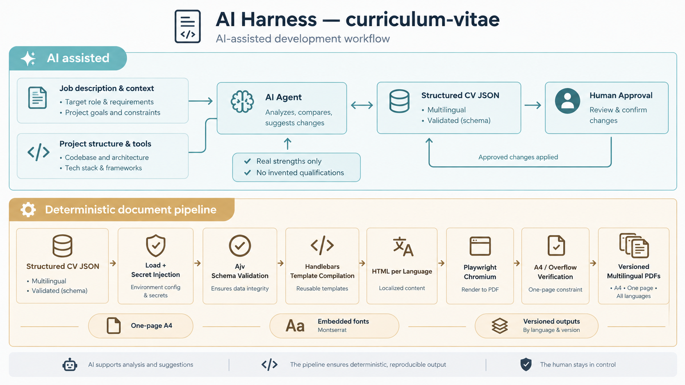
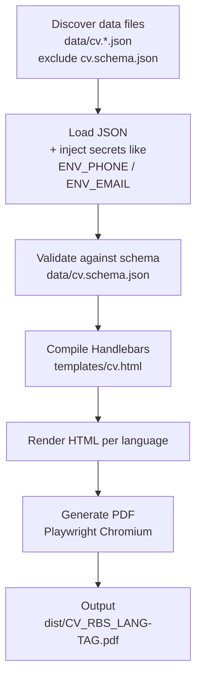

# RBS — Curriculum Vitae Generator

Generate versioned, single-page A4 PDFs of Roberto Stanziale's CV from typed JSON + Handlebars, via Playwright.

> Sanitized CVs without personal information are available on the [Releases](https://github.com/rstanziale/curriculum-vitae/releases) page.

## AI Harness

This project includes an AI-assisted workflow for tailoring the CV to specific job opportunities.



At the core of the workflow is a **Technical Recruiter** agent. It analyzes a job description from the perspective of a technical recruiter, compares its requirements with the candidate's actual experience, and identifies which skills, experiences, and aspects of the profile should be emphasized.

The agent has access to the repository context, structured CV data, and project-specific tools. Its role is not to rewrite the CV freely, but to provide targeted, evidence-based suggestions that improve the alignment between the existing profile and the target position.

The workflow enforces explicit constraints: **real strengths only, no invented qualifications**. Proposed changes are applied to the structured CV data only after human review and approval.

Once approved, the deterministic document generation pipeline takes over: the validated CV data is rendered for each language, converted into PDFs through Playwright, and checked against the A4 single-page requirements.

This separation keeps the AI responsible for **analysis and recommendations**, while the deterministic pipeline remains responsible for **reproducible document generation and validation**.

## Document Generation Pipeline


```mermaid
flowchart TD
    A[Discover data files<br/>data/cv.*.json<br/>exclude cv.schema.json]
    --> B[Load JSON<br/>+ inject secrets like<br/>ENV_PHONE / ENV_EMAIL]

    B --> C[Validate against schema<br/>data/cv.schema.json]

    C --> D[Compile Handlebars<br/>templates/cv.html]

    D --> E[Render HTML per language]

    E --> F[Generate PDF<br/>Playwright Chromium]

    F --> G[Output<br/>dist/CV_RBS_LANG-TAG.pdf]
```

Each language file follows the same `load → validate → render → print` flow. Adding `data/cv.fra.json`, for example, is enough to produce `CV_RBS_FRA-{tag}.pdf` with no code change.

## Project Structure

```text
curriculum-vitae/
├── data/            # CV content — one JSON per language + JSON Schema for validation
├── templates/       # Handlebars layout — A4 grid, BEM CSS, @page/@font-face
├── assets/fonts/    # Montserrat TTF — embedded at build time so PDFs are self-contained
├── src/
│   ├── config/      # Centralized paths and version tag
│   ├── data/        # Loading, secret injection, and Ajv validation
│   ├── template/    # Handlebars registry and compiler
│   ├── pdf/         # Playwright pipeline — options, viewport, font embedding
│   ├── utils/       # FS helpers and timing
│   └── errors/      # Domain errors
├── test/            # Mirrors src/ + integration test that parses real PDFs
└── dist/            # Generated PDFs (gitignored)
```

## Stack

TypeScript (ESM) · Handlebars · Playwright · Ajv

## Prerequisites

* Node >= 20, pnpm
* `npx playwright install chromium` (once)

## Quick Start

```bash
pnpm install
npx playwright install chromium

# .env — see below
pnpm run build:dev   # node --env-file=.env src/index.ts

# or
pnpm run build:prod  # node src/index.ts (uses process.env)

pnpm test            # node --test
```

## Configuration

### Environment Variables

Create `.env` at project root:

```env
CV_TAG="v1.0.0"
PERSONAL_PHONE="+39 320 000 0000"
PERSONAL_EMAIL="name@example.com"
```

| Variable         | Purpose                                     | Default             |
| ---------------- | ------------------------------------------- | ------------------- |
| `CV_TAG`         | Version suffix in `CV_RBS_{LANG}-{tag}.pdf` | `test`              |
| `PERSONAL_PHONE` | Replaces `ENV_PHONE` placeholder            | `+39 000 000 0000`  |
| `PERSONAL_EMAIL` | Replaces `ENV_EMAIL` placeholder            | `email@example.com` |

`build:dev` loads `.env` via `--env-file`; `build:prod` expects variables in the shell, for example in CI.

## Data & Template

Minimal `data/cv.*.json` shape (full schema in `data/cv.schema.json`):

```json
{
  "personalInfo": {
    "firstName": "Roberto",
    "surname": "Stanziale",
    "phone": "ENV_PHONE",
    "email": "ENV_EMAIL"
  },
  "labels": {
    "aboutMe": "About Me",
    "skills": "Skills"
  },
  "aboutMe": "Short bio...",
  "languages": [{ "name": "Italian", "level": "Native" }],
  "hardSkills": ["TypeScript", "Angular"],
  "workExperience": [
    { "company": "Acme", "role": "Developer", "period": "2020 / now" }
  ]
}
```

`templates/cv.html` binds data with expressions such as `{{personalInfo.firstName}}` and `{{#each languages}}`, following Handlebars syntax.

CSS is scoped to the `cv` class and uses BEM naming.

## PDF Requirements

The pipeline enforces the following document constraints:

* **One page, A4** — `@page { size: A4; margin: 0 }`, viewport `794×1123`. The build warns if content overflows the single page.
* **Zero margins, background preserved** — colors and Montserrat render as defined by the template.
* **Fonts embedded** — `assets/fonts/Montserrat-*.ttf` are inlined as `data:` URIs so the PDF renders offline and consistently on any machine.
* **Self-contained HTML** — a `<base>` tag is injected so relative asset paths resolve without a server.
* **Versioned output** — each PDF is named `CV_RBS_{LANG}-{tag}.pdf` from `CV_TAG` (defaults to `test`).

## Output

The following PDFs are generated in `dist/` when the build succeeds:

```text
dist/
├── CV_RBS_ITA-v1.0.0.pdf
└── CV_RBS_ENG-v1.0.0.pdf
```
